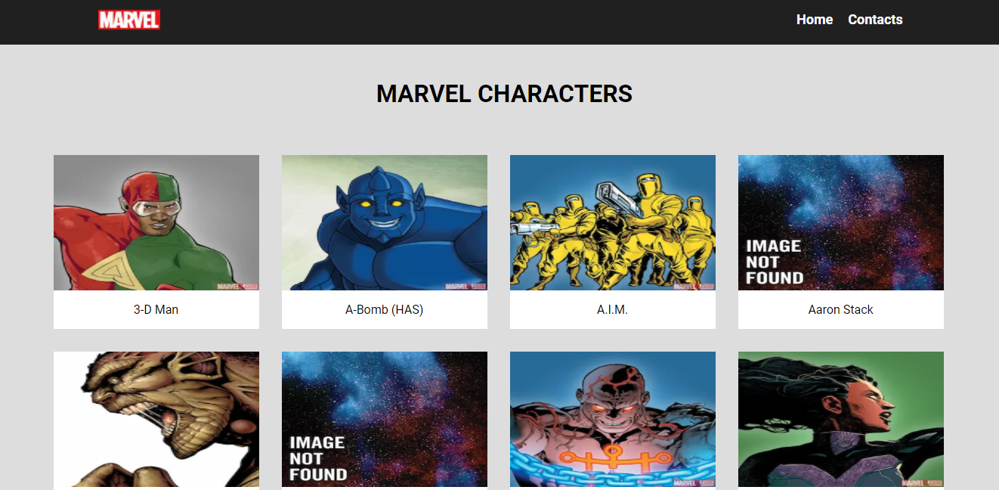
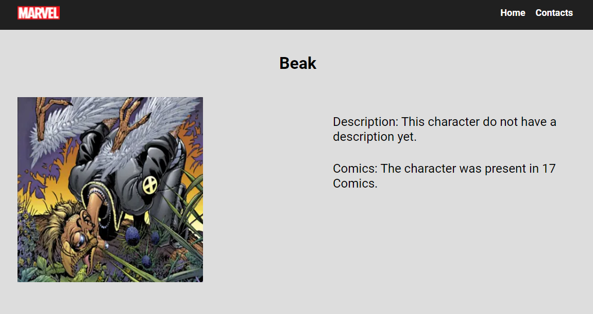

# Projeto Marvel

[LINK DO PROJETO NA VERCEL](https://marvel-page.vercel.app/)

## Introdução
Este projeto foi realizado como challenge para @bitspace-solutions e para o aprendizado. 

## Instalação

Clone o repositório, entre na pasta raiz e rode o comando:

```bash
npm install
# ou
yarn install
```

## Como Utilizar
Depois da instalação entre na pasta raiz e rode o comando:


```bash
npm run dev
# ou
yarn dev
```

O servidor subirá no endereço [http://localhost:3000](http://localhost:3000) . Basta acessa-lo pelo browser de sua preferencia.

## Imagens



